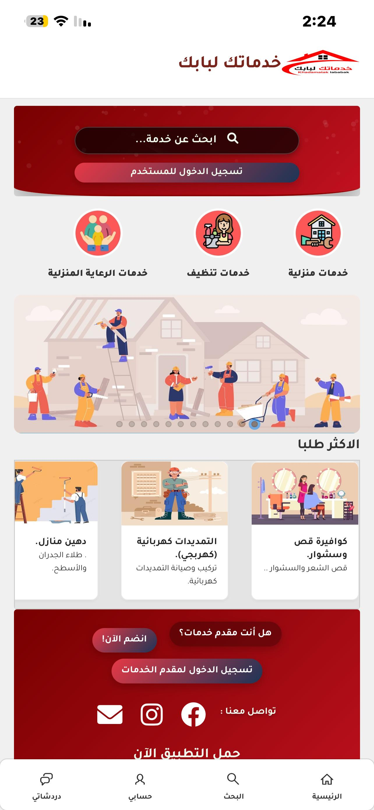
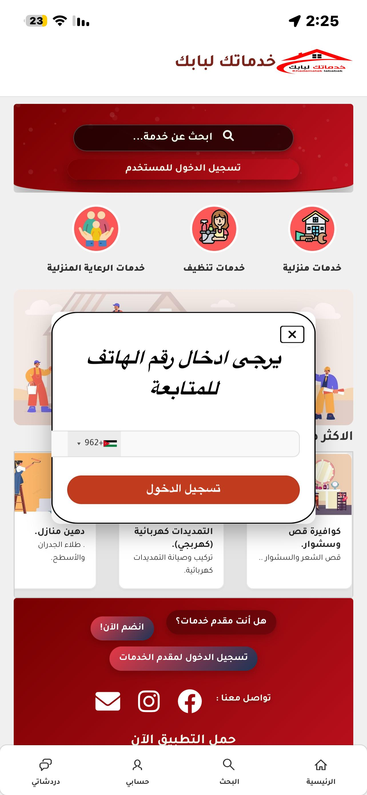
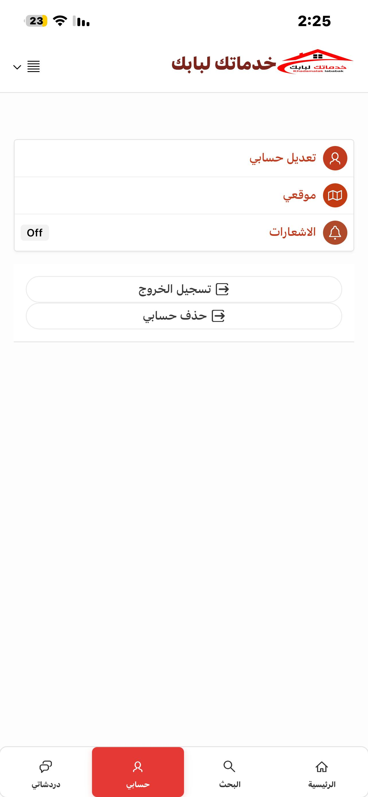

# Lababak Platform

## Overview

Lababak is a scalable on-demand service marketplace platform developed using Oracle APEX and Oracle Database.

The platform connects customers with service providers through a modern, secure, and user-friendly environment, offering seamless service discovery, request management, and communication workflows.

The system was designed with a strong focus on performance, scalability, responsive UI/UX, and enterprise-level security practices.

---

## Live Platform

🌐 https://lababak.com

---

## Mobile Application

📱 Available on Google Play Store

The Lababak mobile application allows users to browse services, submit requests, communicate with providers, and manage their activities directly from mobile devices.

---

## Key Features

- Multi-role authentication system
- Service request management
- Real-time communication workflows
- Advanced service search and categorization
- Interactive dashboards and reports
- Responsive modern UI/UX
- Mobile-friendly experience
- Secure session management
- REST API integration
- Performance optimization and SQL tuning

---

## Technologies Used

- Oracle APEX
- Oracle Database
- SQL & PL/SQL
- REST APIs
- JavaScript
- jQuery
- HTML5
- CSS3
- Oracle Cloud Infrastructure (OCI)

---

## Architecture Highlights

- Modular Oracle APEX application architecture
- Optimized database schema and indexing strategies
- High-performance PL/SQL backend logic
- Secure authentication and authorization handling
- Query optimization and execution plan tuning
- Scalable and maintainable enterprise structure

---

## Screenshots

### Home Page

### LOGIN Page

### Services

### Mobile View

### User Profile

---

## About the Project

Lababak was engineered as a full-featured service marketplace platform supporting seamless interaction between customers and service providers.

The platform focuses on usability, scalability, and efficient workflow management while leveraging Oracle technologies for enterprise-grade performance and reliability.

---

## Important Notice

This repository is a portfolio showcase only.

Sensitive production code, credentials, database exports, and private business logic are intentionally excluded for security and privacy purposes.

---

## Developer

Ahmad Almomani

Oracle APEX Developer

### Expertise
- Oracle APEX
- Oracle Database
- SQL & PL/SQL
- REST APIs
- Performance Optimization
- Enterprise Application Development

🌐 https://lababak.com
